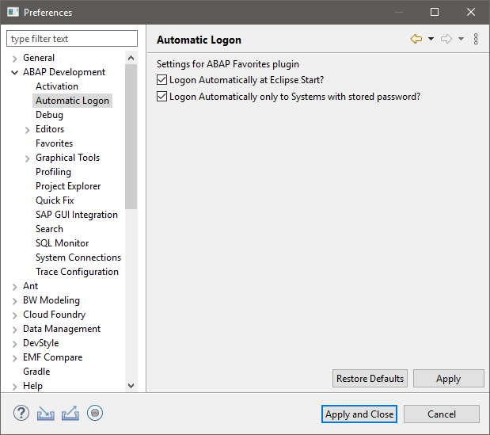

# ABAP Project Extensions

## Version 1.0.5

## Version 1.0.4
Two new parameters and functionalities added.

- Automatically logon at expand of project.

>Once this setting will be turned on, whenever there is a proper user & password stored in the Passwords view and you've not logged to project yet and you click on 	expand project button, then automatic logon will take place. This logon is done in 	foreground in order to omit the standard SAP logon screen.

- Ask for password to be stored as creation of new project.

>Whenever you create a new SAP project, you'll get the popup to setup passwords for it. You'll not need to do it manually later.

## Version 1.0.3

[Autmatic logon](https://abapblog.com/articles/how-to/168-abap-extensions-automatic-logon) was introduced with this version.

A new view called "Passwords" was added, where you can create entries for several clients and users for each of the SAP project in your project explorer.

Passwords are stored in the Secure Storage of Eclipse. You decide if they are stored encrypted or in plain text. 

Once you have a password and user stored and your Automatic Logon Preferences are set to do automatic logon at start of Eclipse, the credentials will be used to do logon. All this will be done in the background asynchronously . You can see the progress of each logon in the "Progress" view.

## Earlier Versions